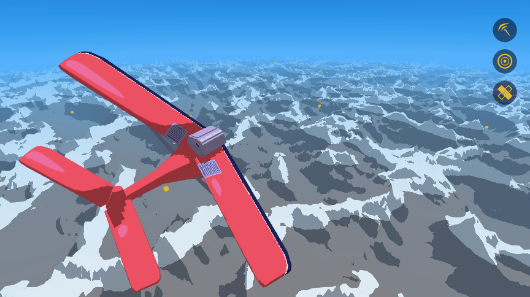

# FLIGHT

<p align="center">
  
</p>

Flight is an upcoming open source aerial combat game built on OpenGL. It features procedurally generated content, and smooth cel shaded graphics.

## Building

Build dependencies for FLIGHT are:
* FreeType
* SFML
* libnoise

Library dependencies are provided for you in the deps/ folder, you just have to compile them first. If you have trouble compiling FreeType for whatever reason, there are a pre-build versions in deps/sfml-2.4.1/extlibs/

You'll also need cmake.

After you've set up all the dependencies, go to the build folder. Run:
```bash
cmake .
make
```

If you run into any problems or have questions, feel free to contact me at evan.a.bowman@gmail.com.
In theory this project should build on any major desktop operation system, but my own development environment is macOS and I haven't yet tried builds on Windows, Linux, etc.
